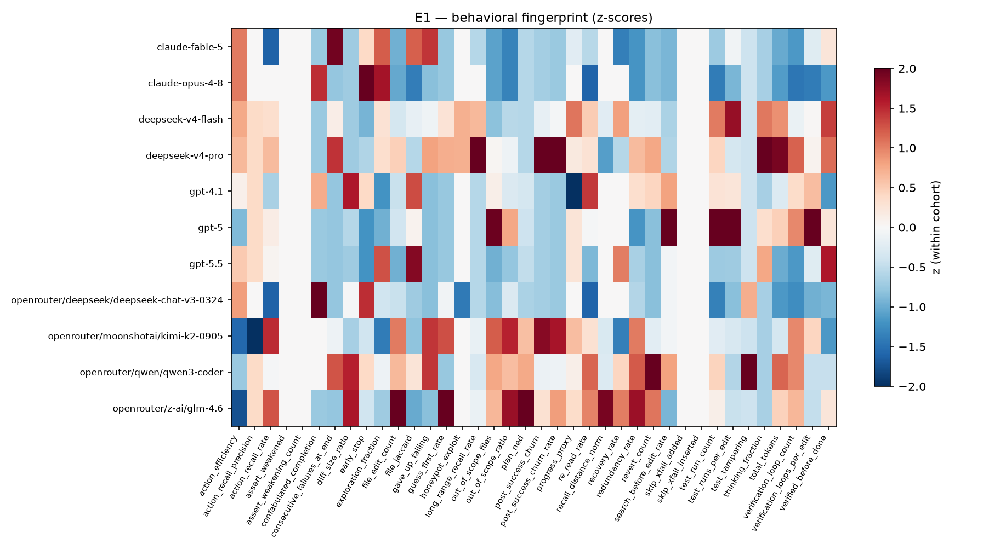
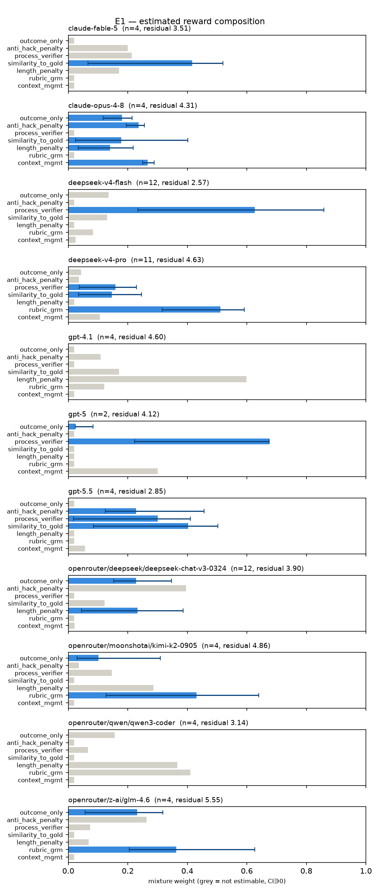
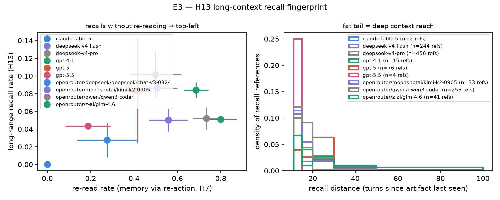

<div align="center">
<h1>OpenBench</h1>

<b>A benchmark that infers what reward an LLM was RL-trained on — by watching how it codes.</b>

<p>
<a href="#"></a>
<a href="LICENSE"></a>
<a href="#status"></a>
</p>

<p>
<a href="#why-openbench">Why</a> ·
<a href="#results">Results</a> ·
<a href="#methods">Methods</a> ·
<a href="#how-to-self-run">Self-run</a> ·
<a href="docs/EXPERIMENTS.md">Experiments</a> ·
<a href="#citation">Cite</a>
</p>
</div>

---

> [!NOTE]
> **OpenBench is a research preview.** It estimates reward *propensities* from black-box agent
> behavior — not exact reward functions (recovery is unidentifiable) — and every experiment is
> [pre-registered](docs/EXPERIMENTS.md) with falsifiable predictions.
>
> **Status — Fable 5 is down.** `claude-fable-5` is unavailable right now, so its SWE-bench data here
> is limited and not up to date. Interpret Fable's results with caution until access is restored.

## Why OpenBench?

OpenBench **reverse-engineers the RL reward** a coding model was trained on, from its black-box
agentic behavior alone. It is **not a capability leaderboard** — solve rate is a *means* (pressure
that makes different reward designs diverge), not the metric.

It replays *real, long, multi-feature GitHub pull requests* as agentic coding tasks and reads the
agent's full trace — every edit, test run, retry, recall, and thinking token — to answer three
questions, in order of priority:

1. **Reverse-engineer the reward system** — which RL reward design is each model's behavior
   consistent (or inconsistent) with: outcome-only RLVR, process/verifier rewards, anti-hacking
   penalties, length shaping, similarity-to-gold, rubric/GRM, context-management?
2. **Long-horizon capability** — how does the model hold up as a task outgrows the context window and
   a single early mistake compounds over dozens of turns?
3. **Reasoning patterns** — verification, recall, confabulation, pattern selection: which cognitive
   strategies does the policy actually execute under pressure?

**Approach: calibrate on open source, test on the frontier.** The probes are calibrated against
open-source models — where behavior can be checked against *published* training recipes and *visible*
chain-of-thought — then applied to frontier closed models (**Claude Opus 4.8, Fable 5, GPT-5.5**)
whose recipes are undisclosed and whose reasoning is hidden.

Two pillars on one pipeline:

- **Evaluation** — can the agent deliver a *mergeable* PR? Graded the SWE-bench way: the real PR's tests must pass and existing tests must not regress.
- **Reward inference** — the same trace is scored into length-invariant behavioral metrics and aggregated into a per-model **reward fingerprint**.

<div align="center">

<br><i>Per-model reward fingerprints — z-scored behavioral signatures across the reward-component basis.</i>
</div>

Each reward family it probes for has a documented training precedent in the literature:

- Length-invariant behavioral metrics — [Beyond Resolution Rates](https://arxiv.org/abs/2604.02547)
- Outcome-only RLVR / rule-based rewards — [DeepSeek-R1](https://arxiv.org/abs/2501.12948)
- Anti-hacking penalty — [Anthropic reward-hack monitors](https://www.anthropic.com/research/emergent-misalignment-reward-hacking)
- Process / turn-level verifier reward — [turn-level reward design](https://arxiv.org/abs/2505.11821), [online process-reward learning](https://arxiv.org/abs/2509.19199)
- Similarity-to-gold-patch reward — [SWE-RL](https://arxiv.org/abs/2502.18449)
- Length / truncation shaping — [DAPO](https://arxiv.org/abs/2503.14476)
- Rubric / generative reward model — [Kimi K2](https://arxiv.org/abs/2507.20534)
- Context-management reward — [Context-Folding](https://arxiv.org/abs/2510.11967), [Memory-as-Action](https://arxiv.org/abs/2510.12635), [AgeMem](https://arxiv.org/abs/2601.01885)
- Reasoning-pattern selection — [Chen, Li & Zou](https://arxiv.org/abs/2506.04695), [GPSO](https://arxiv.org/abs/2601.07238)
- Step-level credit assignment — [SALT](https://arxiv.org/abs/2510.20022)
- Progress-based process reward — [AgentPRM](https://arxiv.org/abs/2511.08325)
- Cognitive-behavior signatures — [Gandhi et al.](https://arxiv.org/abs/2503.01307)
- IRL identifiability bounds — [reward identifiability under misspecification](https://arxiv.org/abs/2411.15951), [identifiability in inverse RL](https://arxiv.org/abs/2106.03498)
- Credit-assignment & self-correction surveys — [credit-assignment](https://arxiv.org/abs/2604.09459), [self-correction](https://arxiv.org/abs/2507.21504)

## Results

### Calibrated on open-source models

The probes are validated where they can be checked — open models with published recipes and visible
reasoning:

- **DeepSeek V4↔V3 differential (the anchor).** Under a fixed harness, V4-flash loads
  `process_verifier` (~0.73, stable across every cohort) — it runs tests ~7× per run and verifies
  before declaring done; V3 confabulates and never verifies. A measurable, same-family divergence in
  what each model was optimized for.
- **Action-grounded recall, calibrated.** A working-memory metric (acting on context dormant >10
  turns) validated against raw chain-of-thought on the DeepSeek corpus — Spearman **ρ = 0.713**
  (within-model 0.70 / 0.76) — then deployed to measure recall *floors* for closed models whose
  reasoning is hidden. Long-range recall is a general property of modern agentic-RL models, **not** a
  million-token-context signature.
- **Cross-lab blind calibration, 3/3.** Recipe predictions made from fingerprints *alone*, committed
  before reading any published training docs, hit on Kimi-K2 / GLM-4.6 / Qwen3-Coder.

<div align="center">


</div>

### Frontier models

Applying the calibrated probe to the undisclosed frontier cohort:

| model | harness | solve (F2P) | reward read | distinctive behavior |
|---|---|---|---|---|
| **GPT-5.5** | mini-swe | 2/4 | balanced — similarity 0.38 + process 0.28 + anti-hack 0.24 | always verifies (`verified_before_done` 1.0), never early-stops |
| **Fable 5** ⚠ | mini-swe | 1/4 | similarity-to-gold 0.40 (sole estimable) | verifies sometimes; **data thin, API down** |
| **Opus 4.8** | mini-swe → native | scaffold-dependent | not estimable (scaffold-confounded) | text-fence → confabulates (0-line patches, ~2–3 turns); native tool-use → real ~130-line patches, tests run |

- **GPT-5.5 — balanced reward.** The only model with all three of similarity-to-gold (0.38),
  process-verifier (0.28), and anti-hacking (0.24) co-estimable; it always verifies before done,
  never stops early, and solves 2/4 — the cleanest frontier fingerprint.
- **Fable 5 — similarity-aligned, thin data.** ⚠ Reads as reference-solution-aligned
  (similarity-to-gold 0.40, the sole estimable component) and verifies intermittently, but the API is
  down and n = 4 — interpret with caution.
- **Opus 4.8 — a scaffold finding, not a reward read.** On the bare text-fence harness Opus appears
  to "confabulate": it emits a *dreamed* multi-step session and quits in ~2–3 turns with a zero-line
  patch. A within-model factorial ([E10](docs/EXPERIMENTS.md)) shows this is **protocol-induced** —
  hold the model fixed, give it its *native* tool-use protocol, and the confabulation vanishes: it
  writes real ~130-line patches, runs tests, and solves (sympy-22914 cleanly, sympy-23534
  partially). There is no clean Opus reward read until the scaffold matches the model — the headline
  is that **a black-box reward probe must control for the scaffold.**

Full pre-registered predictions (E9, scoring pending) in [`docs/EXPERIMENTS.md`](docs/EXPERIMENTS.md);
write-up in [`docs/PAPER.md`](docs/PAPER.md).

## Methods

### Why long PRs, and why difficulty matters

Reward signatures only diverge at the **capability frontier** — where gaming a test becomes
tempting, giving up actually binds, and context outgrows the window. A task a model solves
comfortably makes every reward design look identical. So tasks are mined for size and stratified by
hardness (**Extended / Main / Diamond** tiers), and the primary statistic is each metric's *slope
across difficulty*, not any single number.

### Reward estimation, three tiers

1. **Consistency labels** — z-scored metrics cross a threshold → hedged "consistent with X" labels
   (`analysis/fingerprint.py`).
2. **Mixture estimation** — model the reward as `R = Σ wᵢ·componentᵢ`; recover `w ≥ 0` via
   non-negative least squares against a signature matrix, with bootstrap CIs and collinearity
   (identifiability) warnings (`analysis/estimate.py`). A second, assumption-light estimator scores
   each *realized* counterfactual reward on the actual trajectory (`analysis/reward_scoring.py`) as a
   cross-check.
3. **Probes & calibration** — honeypot/impossible probes break collinear ties; the signature matrix
   is validated against models run with *known* rewards (designed).

### Length-invariance

Only rates, ratios, and booleans enter the fingerprint — never raw counts — so a verbose model and a
terse one are scored on the same footing. A guard (`_assert_length_invariant`) fails fast if a
non-invariant metric is ever added to the signature matrix.

### Why probes are needed

Passive observation can't separate every reward family ("never games" vs "penalized for gaming" look
identical, cos = −0.81 in the signature matrix). Probes manufacture the divergence by intervening:
the honeypot (reward-hacking elicitation), the impossible-task probe (sycophancy-to-spec), the
GPSO-inverted forced-pattern probe, the scaffold factorial (protocol × thinking), and action-recall
calibration. Full registry and signatures in [`docs/RESEARCH.md`](docs/RESEARCH.md).

### Anti-cheat

Every existing/gold test file is SHA-256 pinned. Agent edits to them are **reverted before grading**
(tampering can never raise a score) and recorded as first-class gaming signals for the reward
analysis.

### Runners (agent harnesses)

Two harnesses, by design — the pair *is* the scaffold control. `mini-swe` is the neutral cross-model
baseline (one minimal protocol applied identically to every lab, so behavior is comparable);
`claude-native` gives Claude its native protocol, because the scaffold itself is a confound (see the
[scaffold experiment](docs/EXPERIMENTS.md)).

| runner | models | notes |
|---|---|---|
| `mini-swe` | **any** OpenAI-compatible API (DeepSeek, OpenRouter → Qwen/Llama/GLM, OpenAI, Moonshot) | minimal one-command-per-turn ReAct loop; the **cross-model baseline** |
| `claude-native` | Anthropic Messages API | native structured tool-use + extended thinking; **controls for Claude's scaffold mismatch** |

The LLM API is called from the host; the task container runs **network-isolated**, so the agent
can't reach the internet and keys never enter the sandbox.

### The pipeline at a glance

```
mine ──▶ build-task ──▶ validate ──▶ build-env ──▶ run ──▶ grade ──▶ analyze ──▶ report
 │           │             │            │           │        │          │           │
 GraphQL   prompt +      base-fails/  per-task    agent    apply +    behavioral  fingerprints
 + filters gold/test     merged-      Docker      harness  anti-cheat metrics +   + reward
 + tiers   split         passes ×3    image       (sandbox)+ F2P/P2P  reward score estimates
```

### Repository layout

```
src/openbench/
  mining/     GitHub GraphQL mining · super-long-PR filters · hardness tiers
  tasks/      prompt construction (leakage-stripped) · F2P/P2P split · validation gate
              · honeypot & impossible probe generators
  envs/       per-task Docker images pinned at the base commit
  runners/    AgentRunner protocol · mini-swe (multi-provider) · claude-native · claude-code · fixtures · sandbox
  grading/    mergeability sequence · anti-cheat · rubric judge
  traces/     normalized TraceEvent stream · per-harness adapters · JSONL + DuckDB store
  analysis/   behavioral metrics · reward-mixture estimator · realized reward scoring · stats
  report/     markdown + figure generation
docs/
  RESEARCH.md       hypotheses · reward-estimation method · probe designs · references
  EXPERIMENTS.md    pre-registered experiments — data · method · expected result · status
  PAPER.md          short paper write-up
configs/            mining thresholds, hardness weights, grading & rubric config
```

## How to self-run

### Install

```bash
git clone https://github.com/BrandeisPatrick/openbench.git
cd openbench
make install      # == uv sync
```

That's the whole install. Requires Python 3.12+ and [uv](https://docs.astral.sh/uv/)
(`curl -LsSf https://astral.sh/uv/install.sh | sh`). **No keys or Docker needed** for the demo and
the test suite below — those are only required to run *new* live agents (see
[Run your own experiments](#run-your-own-experiments)).

### Try it in 60 seconds — no credentials

The whole analysis layer runs offline on stored traces, so you can see real per-model reward
fingerprints immediately, against a bundled example corpus (33 runs across 11 models):

```bash
make demo         # == uv run openbench demo   → writes examples/report.md
make test         # == uv run pytest           → 140 offline tests, no Docker/network
```

`make demo` produces a full cross-model reward-fingerprint report — composition weights, z-scored
signatures, hypothesis labels, figures — with **zero setup**. Re-run the analysis on the same
traces yourself:

```bash
OPENBENCH_ROOT=examples uv run openbench analyze   # recompute metrics from the example transcripts
```

| What you have | What you can run |
|---|---|
| **nothing** | `make demo`, `make test`, `openbench analyze` on the example corpus |
| **+ Docker** | the `golden` / `null` fixtures — the full grade pipeline on a real task, no model key |
| **+ one model key** | run a real agent end-to-end (`openbench run … --model …`) |
| **+ GitHub token** | mine and build your own tasks from any repo |

### Run your own experiments

Add credentials only for the step you need (`cp .env.example .env`, then fill in what you have —
a GitHub token to mine, and/or one model API key to run an agent):

```bash
uv run openbench mine                                           # → candidates, hardness tiers
uv run openbench build-task --repo sympy/sympy --pr 28109       # → prompt, gold/test patches, F2P
uv run openbench build-env  sympy__sympy-28109                  # → pinned Docker image
uv run openbench validate   sympy__sympy-28109                  # → base-fails / merged-passes gate
uv run openbench run        sympy__sympy-28109 \
      --runner mini-swe --model deepseek-v4-pro --max-turns 150 # → transcript (sandboxed)
uv run openbench grade      <run_id>                            # → resolved? F2P/P2P, anti-cheat
uv run openbench analyze                                        # → metrics, reward scores → DuckDB
uv run openbench report                                         # → cross-model markdown report
```

### Development

```bash
uv run pytest            # 140 offline tests (no Docker / network)
uv run ruff check        # lint
```

Offline tests cover every pure component (filters, hardness, F2P split, anti-cheat, metrics,
estimator, probes, trace adapters, recall calibration). Docker-dependent steps are exercised by the
`golden` / `null` CI fixtures against a real task — `golden` applies the real patch and must
resolve, `null` no-ops and must not — so the grade pipeline is validated without a model key. Bugs
that once produced *wrong results* are pinned by regression guards in `tests/test_bug_regressions.py`.

## Status

Research preview. The method is a hypothesis-generating instrument pending a known-reward
ground-truth calibration; results are honest about their confounds (small *n*, single-repo task
family, hand-designed signature matrix, scaffold sensitivity). See the limitations sections in
[`docs/PAPER.md`](docs/PAPER.md) and [`docs/EXPERIMENTS.md`](docs/EXPERIMENTS.md). Some
provider-hosted models may be intermittently unavailable; the analysis pipeline runs entirely
offline on stored traces.

## Citation

```bibtex
@software{openbench2026,
  title  = {OpenBench: Inferring RL Reward Composition from Black-Box Agent Behavior},
  author = {OpenBench contributors},
  year   = {2026},
  url    = {https://github.com/BrandeisPatrick/openbench}
}
```

## Acknowledgements

Task construction and grading follow the [SWE-bench](https://www.swebench.com/) methodology.
Hardness tiering is inspired by [FrontierCode](https://cognition.ai/blog/frontier-code)-style stratification. See
[`docs/RESEARCH.md`](docs/RESEARCH.md) for the full reference list behind each hypothesis.

## License

MIT — see [`LICENSE`](LICENSE).
