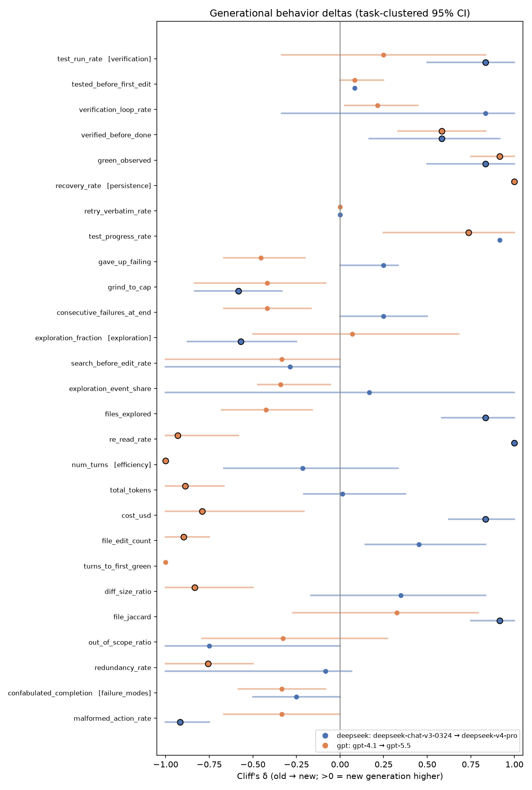
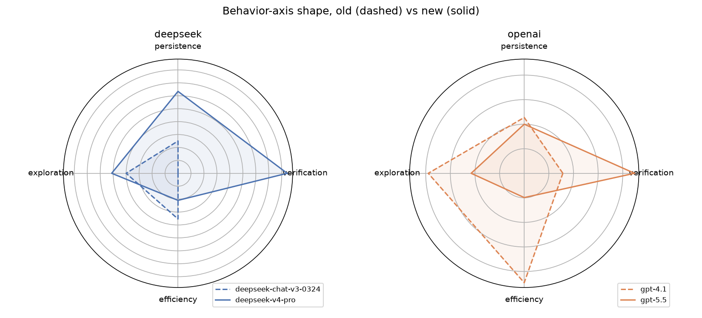
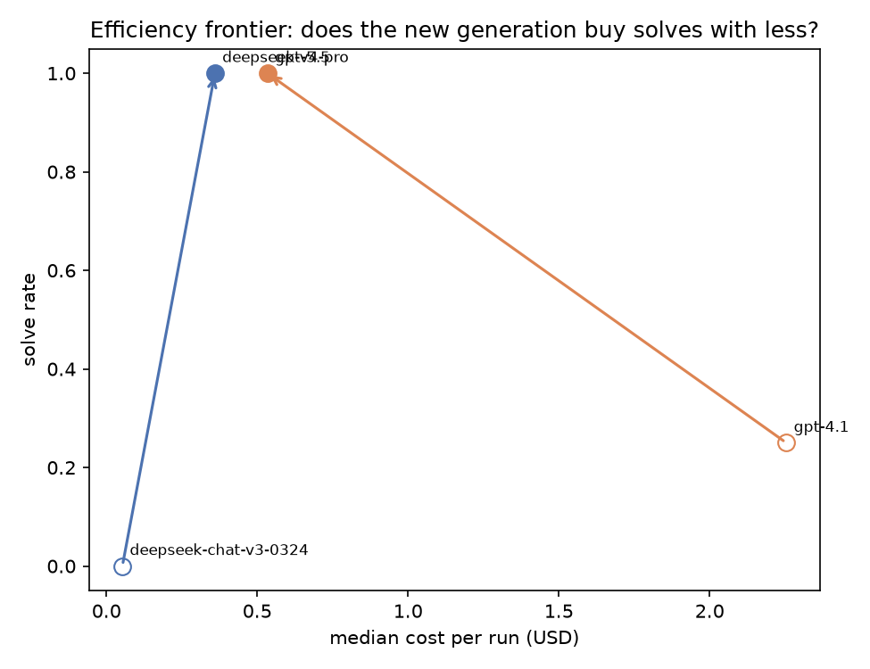
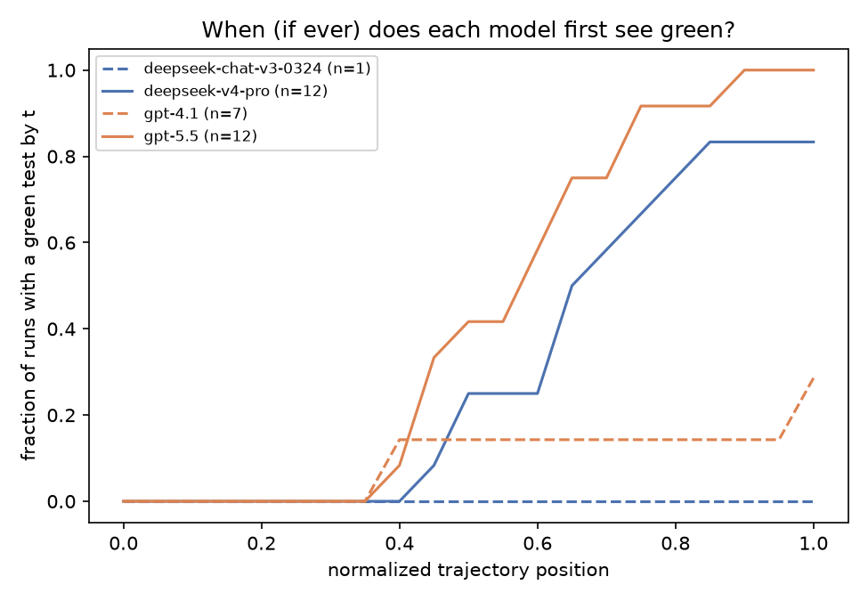
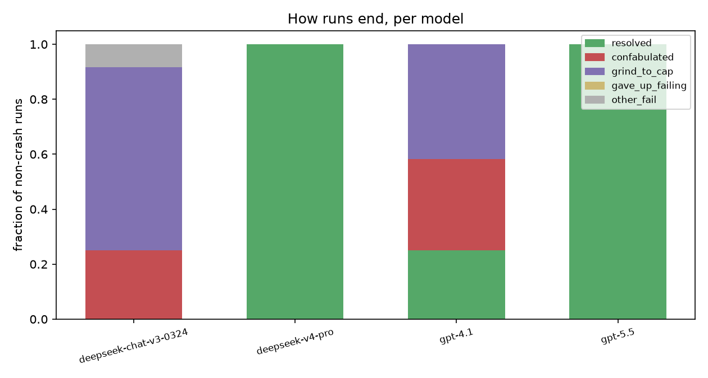

# Generational behavior comparison

> **Read me first.** This is a *descriptive* comparison, not hypothesis
> confirmation: n per model is small and the true degrees of freedom are the
> number of tasks, so every interval is a task-clustered bootstrap and the
> per-task sign agreement matters more than any single number. Contrasts are
> within-lab only (same wire protocol per pair — scaffold effects cancel);
> cross-lab differences are confounded by protocol and pricing. Solve rates
> are stratified by task provenance because SWE-bench-Verified PRs predate
> every model's training cutoff while mined PRs postdate the old generation's.

## deepseek: `openrouter/deepseek/deepseek-chat-v3-0324` → `deepseek-v4-pro`

Runs: 21 old / 21 new (crashes excluded: 2 / 2)

### Solve rate

- **overall**: 0/21 → 12/21 (Δ 0.57 (95% CI [+0.14, +0.86]))
- **swebench-verified**: 0/12 → 12/12 (Δ 1.00 (95% CI [+1.00, +1.00]))
- **mined**: 0/9 → 0/9 (Δ 0.00 (95% CI [+0.00, +0.00]))

### What changed (headline effects)

- `malformed_action_rate` [failure_modes] ↓ — δ -0.95 (CI [-1.00, -0.86]), 7/7 tasks ↓; median 1.00 → 0.00
- `cost_usd` [efficiency] ↑ — δ 0.90 (CI [+0.78, +1.00]), 7/7 tasks ↑; median 0.05 → 1.14
- `files_explored` [exploration] ↑ — δ 0.88 (CI [+0.74, +0.99]), 7/7 tasks ↑; median 0.00 → 6.00
- `file_jaccard` [efficiency] ↑ — δ 0.79 (CI [+0.61, +0.93]), 6/7 tasks ↑; median 0.00 → 1.00
- `green_observed` [verification] ↑ — δ 0.76 (CI [+0.52, +0.95]), 5/7 tasks ↑; median 0.00 → 1.00
- `test_run_rate` [verification] ↑ — δ 0.74 (CI [+0.49, +0.95]), 5/7 tasks ↑; median 0.00 → 0.11
- `file_edit_count` [efficiency] ↑ — δ 0.52 (CI [+0.24, +0.80]), 6/7 tasks ↑; median 0.00 → 2.00
- `out_of_scope_ratio` [efficiency] ↓ — δ -0.51 (CI [-1.00, -0.17]), 3/5 tasks ↓; median 0.50 → 0.00
- `re_read_rate` [exploration] ↑ — δ 0.49 (CI [+0.25, +1.00]), 5/6 tasks ↑; median 0.10 → 0.78

### Full delta table

| axis | metric | old median | new median | Cliff's δ | 95% CI | tasks agree | n |
|---|---|---:|---:|---:|---|---|---|
| verification | `test_run_rate`** | 0.00 | 0.11 | 0.74 | [+0.49, +0.95] | 5/7 tasks ↑ | 21/21 |
| verification | `tested_before_first_edit` | 0.00 | 0.00 | 0.30 | [+0.00, +0.50] | 2/5 tasks ↑ | 8/20 |
| verification | `verification_loop_rate` | 0.10 | 0.67 | 0.42 | [-0.18, +0.96] | 2/5 tasks ↑ | 8/20 |
| verification | `verified_before_done` | 0.00 | 0.00 | 0.43 | [+0.19, +0.67] | 3/7 tasks ↑ | 21/21 |
| verification | `green_observed`** | 0.00 | 1.00 | 0.76 | [+0.52, +0.95] | 5/7 tasks ↑ | 21/21 |
| persistence | `recovery_rate` | — | 0.69 | — | — | 0/0 tasks | 0/12 |
| persistence | `retry_verbatim_rate` | 0.00 | 0.00 | 0.05 | [+0.00, +0.20] | 0/5 tasks ↑ | 6/20 |
| persistence | `test_progress_rate` | 0.00 | 0.53 | 0.89 | — | 1/1 tasks ↑ | 1/18 |
| persistence | `gave_up_failing` | 0.00 | 0.00 | 0.26 | [+0.00, +0.33] | 0/3 tasks ↑ | 4/19 |
| persistence | `grind_to_cap` | 1.00 | 0.00 | -0.10 | [-0.57, +0.33] | 2/7 tasks ↓ | 21/21 |
| persistence | `consecutive_failures_at_end` | 0.00 | 0.00 | 0.24 | [+0.10, +0.43] | 1/7 tasks ↑ | 21/21 |
| exploration | `exploration_fraction` | 1.00 | 0.52 | -0.42 | [-0.74, -0.07] | 6/7 tasks ↓ | 21/21 |
| exploration | `search_before_edit_rate` | 1.00 | 1.00 | -0.16 | [-0.57, +0.11] | 2/5 tasks ↓ | 7/15 |
| exploration | `exploration_event_share` | 0.28 | 0.21 | -0.29 | [-0.87, +0.42] | 4/6 tasks ↓ | 10/21 |
| exploration | `files_explored`** | 0.00 | 6.00 | 0.88 | [+0.74, +0.99] | 7/7 tasks ↑ | 21/21 |
| exploration | `re_read_rate`** | 0.10 | 0.78 | 0.49 | [+0.25, +1.00] | 5/6 tasks ↑ | 8/21 |
| efficiency | `num_turns` | 100.00 | 55.00 | -0.16 | [-0.63, +0.33] | 4/7 tasks ↓ | 21/21 |
| efficiency | `total_tokens` | 365906.00 | 924987.00 | 0.39 | [+0.02, +0.76] | 6/7 tasks ↑ | 21/21 |
| efficiency | `cost_usd`** | 0.05 | 1.14 | 0.90 | [+0.78, +1.00] | 7/7 tasks ↑ | 21/21 |
| efficiency | `file_edit_count`** | 0.00 | 2.00 | 0.52 | [+0.24, +0.80] | 6/7 tasks ↑ | 21/21 |
| efficiency | `turns_to_first_green` | — | 21.00 | — | — | 0/0 tasks | 0/16 |
| efficiency | `diff_size_ratio` | 0.00 | 1.00 | 0.33 | [-0.14, +0.75] | 5/7 tasks ↑ | 21/21 |
| efficiency | `file_jaccard`** | 0.00 | 1.00 | 0.79 | [+0.61, +0.93] | 6/7 tasks ↑ | 21/21 |
| efficiency | `out_of_scope_ratio`** | 0.50 | 0.00 | -0.51 | [-1.00, -0.17] | 3/5 tasks ↓ | 8/20 |
| efficiency | `redundancy_rate` | 0.58 | 0.50 | -0.02 | [-1.00, +0.32] | 3/5 tasks ↓ | 8/20 |
| failure_modes | `confabulated_completion` | 0.00 | 0.00 | -0.38 | [-0.62, -0.14] | 2/7 tasks ↓ | 21/21 |
| failure_modes | `malformed_action_rate`** | 1.00 | 0.00 | -0.95 | [-1.00, -0.86] | 7/7 tasks ↓ | 21/21 |

### How runs end

| outcome | old | new |
|---|---:|---:|
| confabulated | 8 | 0 |
| grind_to_cap | 12 | 9 |
| other_fail | 1 | 0 |
| resolved | 0 | 12 |

## openai: `gpt-4.1` → `gpt-5.5`

Runs: 21 old / 21 new (crashes excluded: 29 / 12)

### Solve rate

- **overall**: 3/21 → 12/21 (Δ 0.43 (95% CI [+0.14, +0.71]))
- **swebench-verified**: 3/12 → 12/12 (Δ 0.75 (95% CI [+0.67, +0.92]))
- **mined**: 0/9 → 0/9 (Δ 0.00 (95% CI [+0.00, +0.00]))

### What changed (headline effects)

- `recovery_rate` [persistence] ↑ — δ 1.00 (CI [+1.00, +1.00]), 2/2 tasks ↑; median 0.00 → 1.00
- `turns_to_first_green` [efficiency] ↓ — δ -1.00 (CI [-1.00, -1.00]), 2/2 tasks ↓; median 67.00 → 18.50
- `re_read_rate` [exploration] ↓ — δ -0.91 (CI [-1.00, -0.72]), 7/7 tasks ↓; median 0.93 → 0.74
- `num_turns` [efficiency] ↓ — δ -0.84 (CI [-1.00, -0.37]), 6/7 tasks ↓; median 74.00 → 36.00
- `green_observed` [verification] ↑ — δ 0.76 (CI [+0.48, +0.95]), 6/7 tasks ↑; median 0.00 → 1.00
- `diff_size_ratio` [efficiency] ↓ — δ -0.59 (CI [-0.92, -0.33]), 7/7 tasks ↓; median 203.75 → 4.00
- `test_progress_rate` [persistence] ↑ — δ 0.53 (CI [+0.08, +0.84]), 4/6 tasks ↑; median 0.00 → 0.65
- `verified_before_done` [verification] ↑ — δ 0.48 (CI [+0.19, +0.76]), 4/7 tasks ↑; median 0.00 → 1.00

### Full delta table

| axis | metric | old median | new median | Cliff's δ | 95% CI | tasks agree | n |
|---|---|---:|---:|---:|---|---|---|
| verification | `test_run_rate` | 0.06 | 0.07 | 0.16 | [-0.32, +0.59] | 4/7 tasks ↑ | 21/21 |
| verification | `tested_before_first_edit` | 0.00 | 0.00 | 0.09 | [+0.00, +0.19] | 2/7 tasks ↑ | 20/21 |
| verification | `verification_loop_rate` | 0.50 | 0.50 | 0.06 | [-0.34, +0.42] | 4/7 tasks ↑ | 20/21 |
| verification | `verified_before_done`** | 0.00 | 1.00 | 0.48 | [+0.19, +0.76] | 4/7 tasks ↑ | 21/21 |
| verification | `green_observed`** | 0.00 | 1.00 | 0.76 | [+0.48, +0.95] | 6/7 tasks ↑ | 21/21 |
| persistence | `recovery_rate`** | 0.00 | 1.00 | 1.00 | [+1.00, +1.00] | 2/2 tasks ↑ | 6/7 |
| persistence | `retry_verbatim_rate` | 0.00 | 0.00 | 0.00 | [+0.00, +0.00] | 0/6 tasks ↑ | 21/17 |
| persistence | `test_progress_rate`** | 0.00 | 0.65 | 0.53 | [+0.08, +0.84] | 4/6 tasks ↑ | 17/16 |
| persistence | `gave_up_failing` | 0.00 | 0.00 | -0.29 | [-0.56, -0.06] | 2/6 tasks ↓ | 17/20 |
| persistence | `grind_to_cap` | 0.00 | 0.00 | -0.10 | [-0.52, +0.38] | 2/7 tasks ↑ | 21/21 |
| persistence | `consecutive_failures_at_end` | 0.00 | 0.00 | -0.24 | [-0.48, -0.05] | 2/7 tasks ↓ | 21/21 |
| exploration | `exploration_fraction` | 0.52 | 0.49 | 0.07 | [-0.22, +0.37] | 4/7 tasks ↓ | 21/21 |
| exploration | `search_before_edit_rate` | 1.00 | 0.60 | -0.42 | [-0.70, -0.17] | 3/6 tasks ↓ | 18/17 |
| exploration | `exploration_event_share` | 0.36 | 0.25 | -0.40 | [-0.79, +0.06] | 5/7 tasks ↓ | 21/21 |
| exploration | `files_explored` | 5.00 | 5.00 | -0.12 | [-0.44, +0.21] | 3/7 tasks ↓ | 21/21 |
| exploration | `re_read_rate`** | 0.93 | 0.74 | -0.91 | [-1.00, -0.72] | 7/7 tasks ↓ | 21/21 |
| efficiency | `num_turns`** | 74.00 | 36.00 | -0.84 | [-1.00, -0.37] | 6/7 tasks ↓ | 21/21 |
| efficiency | `total_tokens` | 928730.00 | 383664.00 | -0.56 | [-0.92, +0.02] | 5/7 tasks ↓ | 21/21 |
| efficiency | `cost_usd` | 1.88 | 1.21 | -0.10 | [-0.75, +0.56] | 4/7 tasks ↓ | 21/21 |
| efficiency | `file_edit_count` | 7.00 | 4.00 | -0.41 | [-0.80, -0.04] | 4/7 tasks ↓ | 21/21 |
| efficiency | `turns_to_first_green`** | 67.00 | 18.50 | -1.00 | [-1.00, -1.00] | 2/2 tasks ↓ | 2/18 |
| efficiency | `diff_size_ratio`** | 203.75 | 4.00 | -0.59 | [-0.92, -0.33] | 7/7 tasks ↓ | 21/21 |
| efficiency | `file_jaccard` | 0.20 | 0.50 | 0.29 | [-0.02, +0.61] | 4/7 tasks ↑ | 21/21 |
| efficiency | `out_of_scope_ratio` | 0.67 | 0.00 | -0.34 | [-0.57, -0.04] | 4/7 tasks ↓ | 21/21 |
| efficiency | `redundancy_rate` | 0.63 | 0.42 | -0.36 | [-0.77, +0.17] | 5/7 tasks ↓ | 20/21 |
| failure_modes | `confabulated_completion` | 0.00 | 0.00 | -0.33 | [-0.52, -0.14] | 2/7 tasks ↓ | 21/21 |
| failure_modes | `malformed_action_rate` | 0.00 | 0.00 | -0.43 | [-0.71, -0.14] | 4/7 tasks ↓ | 21/21 |

### How runs end

| outcome | old | new |
|---|---:|---:|
| confabulated | 7 | 0 |
| grind_to_cap | 9 | 7 |
| other_fail | 2 | 2 |
| resolved | 3 | 12 |

## Pairs

- `deepseek`: openrouter/deepseek/deepseek-chat-v3-0324 → deepseek-v4-pro (deepseek)
- `gpt`: gpt-4.1 → gpt-5.5 (openai)
