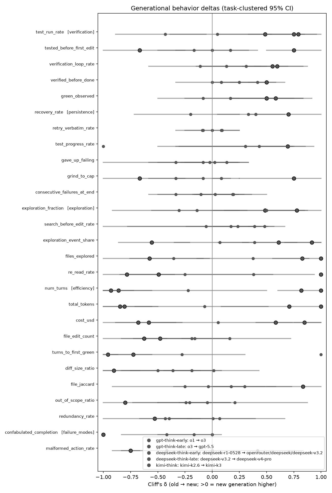
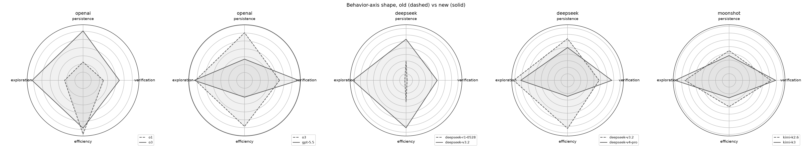
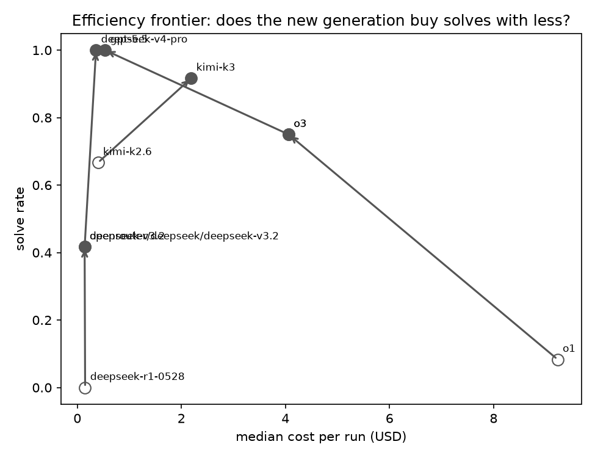
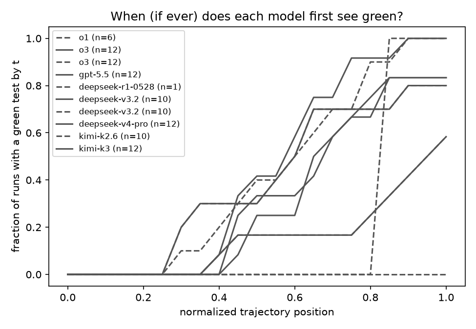
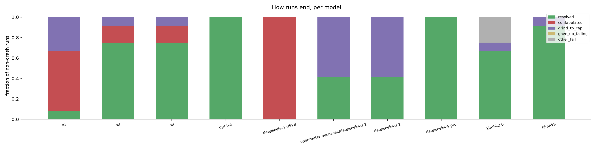

# Generational behavior comparison

> **Corpus restricted to `source == swebench-verified` tasks.**

> **Read me first.** This is a *descriptive* comparison, not hypothesis
> confirmation: n per model is small and the true degrees of freedom are the
> number of tasks, so every interval is a task-clustered bootstrap and the
> per-task sign agreement matters more than any single number. Contrasts are
> within-lab only (same wire protocol per pair — scaffold effects cancel);
> cross-lab differences are confounded by protocol and pricing. Solve rates
> are stratified by task provenance because SWE-bench-Verified PRs predate
> every model's training cutoff while mined PRs postdate the old generation's.

## openai: `o1` → `o3`

Runs: 12 old / 12 new (crashes excluded: 1 / 1)

### Solve rate

- **overall**: 1/12 → 9/12 (Δ 0.67 (95% CI [+0.25, +1.00]))
- **swebench-verified**: 1/12 → 9/12 (Δ 0.67 (95% CI [+0.25, +1.00]))

### What changed (headline effects)

- `diff_size_ratio` [efficiency] ↓ — δ -0.90 (CI [-1.00, -0.67]), 4/4 tasks ↓; median 708.38 → 16.50
- `files_explored` [exploration] ↑ — δ 0.83 (CI [+0.56, +1.00]), 4/4 tasks ↑; median 2.00 → 6.00
- `num_turns` [efficiency] ↑ — δ 0.82 (CI [+0.60, +1.00]), 4/4 tasks ↑; median 26.50 → 80.50
- `total_tokens` [efficiency] ↑ — δ 0.71 (CI [+0.08, +1.00]), 3/4 tasks ↑; median 363953.00 → 1794015.50
- `test_progress_rate` [persistence] ↑ — δ 0.69 (CI [+0.44, +0.93]), 4/4 tasks ↑; median 0.00 → 0.51
- `exploration_event_share` [exploration] ↑ — δ 0.61 (CI [+0.28, +1.00]), 4/4 tasks ↑; median 0.07 → 0.23
- `cost_usd` [efficiency] ↓ — δ -0.58 (CI [-0.89, -0.33]), 4/4 tasks ↓; median 9.22 → 3.68
- `redundancy_rate` [efficiency] ↓ — δ -0.53 (CI [-1.00, -0.11]), 4/4 tasks ↓; median 0.72 → 0.19
- `green_observed` [verification] ↑ — δ 0.50 (CI [+0.17, +0.83]), 2/4 tasks ↑; median 0.00 → 0.50
- `exploration_fraction` [exploration] ↑ — δ 0.49 (CI [+0.11, +0.85]), 4/4 tasks ↑; median 0.13 → 0.25

### Full delta table

| axis | metric | old median | new median | Cliff's δ | 95% CI | tasks agree | n |
|---|---|---:|---:|---:|---|---|---|
| verification | `test_run_rate` | 0.25 | 0.11 | -0.43 | [-0.89, -0.06] | 3/4 tasks ↓ | 12/12 |
| verification | `tested_before_first_edit` | 0.00 | 0.00 | 0.17 | [+0.00, +0.33] | 0/4 tasks ↑ | 12/12 |
| verification | `verification_loop_rate` | 0.65 | 0.70 | 0.31 | [-0.10, +0.69] | 2/4 tasks ↑ | 12/12 |
| verification | `verified_before_done` | 0.00 | 0.00 | 0.25 | [+0.00, +0.50] | 1/4 tasks ↑ | 12/12 |
| verification | `green_observed`** | 0.00 | 0.50 | 0.50 | [+0.17, +0.83] | 2/4 tasks ↑ | 12/12 |
| persistence | `recovery_rate` | 0.00 | 0.00 | 0.40 | [+0.33, +1.00] | 2/3 tasks ↑ | 4/10 |
| persistence | `retry_verbatim_rate` | 0.00 | 0.00 | 0.08 | [+0.00, +0.25] | 0/4 tasks ↑ | 10/12 |
| persistence | `test_progress_rate`** | 0.00 | 0.51 | 0.69 | [+0.44, +0.93] | 4/4 tasks ↑ | 9/12 |
| persistence | `gave_up_failing` | 0.00 | 0.00 | 0.13 | [-0.25, +0.33] | 1/4 tasks ↑ | 10/12 |
| persistence | `grind_to_cap` | 0.00 | 0.00 | -0.08 | [-0.33, +0.17] | 1/4 tasks ↓ | 12/12 |
| persistence | `consecutive_failures_at_end` | 0.00 | 0.00 | 0.19 | [-0.15, +0.36] | 1/4 tasks ↑ | 12/12 |
| exploration | `exploration_fraction`** | 0.13 | 0.25 | 0.49 | [+0.11, +0.85] | 4/4 tasks ↑ | 12/12 |
| exploration | `search_before_edit_rate` | 0.42 | 0.75 | 0.17 | [-0.24, +0.57] | 2/4 tasks ↑ | 10/11 |
| exploration | `exploration_event_share`** | 0.07 | 0.23 | 0.61 | [+0.28, +1.00] | 4/4 tasks ↑ | 12/12 |
| exploration | `files_explored`** | 2.00 | 6.00 | 0.83 | [+0.56, +1.00] | 4/4 tasks ↑ | 12/12 |
| exploration | `re_read_rate` | 0.50 | 0.75 | 0.38 | [-0.50, +0.94] | 3/4 tasks ↑ | 9/12 |
| efficiency | `num_turns`** | 26.50 | 80.50 | 0.82 | [+0.60, +1.00] | 4/4 tasks ↑ | 12/12 |
| efficiency | `total_tokens`** | 363953.00 | 1794015.50 | 0.71 | [+0.08, +1.00] | 3/4 tasks ↑ | 12/12 |
| efficiency | `cost_usd`** | 9.22 | 3.68 | -0.58 | [-0.89, -0.33] | 4/4 tasks ↓ | 12/12 |
| efficiency | `file_edit_count` | 10.50 | 8.00 | -0.19 | [-0.72, +0.14] | 3/4 tasks ↓ | 12/12 |
| efficiency | `turns_to_first_green` | — | 32.00 | — | — | 0/0 tasks | 0/6 |
| efficiency | `diff_size_ratio`** | 708.38 | 16.50 | -0.90 | [-1.00, -0.67] | 4/4 tasks ↓ | 12/12 |
| efficiency | `file_jaccard` | 0.50 | 0.50 | -0.03 | [-0.35, +0.31] | 1/4 tasks ↑ | 12/12 |
| efficiency | `out_of_scope_ratio` | 0.50 | 0.50 | -0.05 | [-0.31, +0.17] | 1/4 tasks ↑ | 12/11 |
| efficiency | `redundancy_rate`** | 0.72 | 0.19 | -0.53 | [-1.00, -0.11] | 4/4 tasks ↓ | 12/12 |
| failure_modes | `confabulated_completion` | 1.00 | 0.00 | -0.42 | [-0.83, +0.08] | 2/4 tasks ↓ | 12/12 |
| failure_modes | `malformed_action_rate` | 0.00 | 0.00 | 0.42 | [+0.00, +0.83] | 2/4 tasks ↑ | 12/12 |

### How runs end

| outcome | old | new |
|---|---:|---:|
| confabulated | 7 | 2 |
| grind_to_cap | 4 | 1 |
| resolved | 1 | 9 |

## openai: `o3` → `gpt-5.5`

Runs: 12 old / 12 new (crashes excluded: 1 / 3)

### Solve rate

- **overall**: 9/12 → 12/12 (Δ 0.25 (95% CI [+0.00, +0.75]))
- **swebench-verified**: 9/12 → 12/12 (Δ 0.25 (95% CI [+0.00, +0.75]))

### What changed (headline effects)

- `turns_to_first_green` [efficiency] ↓ — δ -0.96 (CI [-1.00, -0.87]), 3/3 tasks ↓; median 32.00 → 13.50
- `num_turns` [efficiency] ↓ — δ -0.86 (CI [-1.00, -0.56]), 4/4 tasks ↓; median 80.50 → 22.00
- `total_tokens` [efficiency] ↓ — δ -0.85 (CI [-1.00, -0.56]), 4/4 tasks ↓; median 1794015.50 → 161645.50
- `recovery_rate` [persistence] ↑ — δ 0.70 (CI [+1.00, +1.00]), 2/2 tasks ↑; median 0.00 → 1.00
- `cost_usd` [efficiency] ↓ — δ -0.68 (CI [-1.00, -0.28]), 3/4 tasks ↓; median 3.68 → 0.51
- `green_observed` [verification] ↑ — δ 0.50 (CI [+0.17, +0.83]), 2/4 tasks ↑; median 0.50 → 1.00
- `file_edit_count` [efficiency] ↓ — δ -0.48 (CI [-0.83, -0.14]), 4/4 tasks ↓; median 8.00 → 2.00

### Full delta table

| axis | metric | old median | new median | Cliff's δ | 95% CI | tasks agree | n |
|---|---|---:|---:|---:|---|---|---|
| verification | `test_run_rate` | 0.11 | 0.10 | 0.05 | [-0.39, +0.54] | 2/4 tasks ↑ | 12/12 |
| verification | `tested_before_first_edit` | 0.00 | 0.00 | 0.00 | [-0.33, +0.42] | 1/4 tasks ↑ | 12/12 |
| verification | `verification_loop_rate` | 0.70 | 0.63 | -0.11 | [-0.58, +0.44] | 2/4 tasks ↑ | 12/12 |
| verification | `verified_before_done` | 0.00 | 1.00 | 0.42 | [+0.33, +0.58] | 2/4 tasks ↑ | 12/12 |
| verification | `green_observed`** | 0.50 | 1.00 | 0.50 | [+0.17, +0.83] | 2/4 tasks ↑ | 12/12 |
| persistence | `recovery_rate`** | 0.00 | 1.00 | 0.70 | [+1.00, +1.00] | 2/2 tasks ↑ | 10/6 |
| persistence | `retry_verbatim_rate` | 0.00 | 0.00 | -0.08 | [-0.33, +0.00] | 0/3 tasks ↑ | 12/9 |
| persistence | `test_progress_rate` | 0.51 | 0.75 | 0.31 | [-0.50, +0.75] | 2/4 tasks ↑ | 12/9 |
| persistence | `gave_up_failing` | 0.00 | 0.00 | -0.33 | [-0.58, -0.08] | 1/4 tasks ↓ | 12/12 |
| persistence | `grind_to_cap` | 0.00 | 0.00 | -0.33 | [-0.58, -0.08] | 1/4 tasks ↓ | 12/12 |
| persistence | `consecutive_failures_at_end` | 0.00 | 0.00 | -0.33 | [-0.58, -0.08] | 1/4 tasks ↓ | 12/12 |
| exploration | `exploration_fraction` | 0.25 | 0.36 | 0.50 | [+0.00, +0.88] | 3/4 tasks ↑ | 12/12 |
| exploration | `search_before_edit_rate` | 0.75 | 0.80 | -0.06 | [-0.78, +0.44] | 1/3 tasks ↑ | 11/8 |
| exploration | `exploration_event_share` | 0.23 | 0.26 | 0.39 | [+0.06, +0.78] | 3/4 tasks ↑ | 12/12 |
| exploration | `files_explored` | 6.00 | 4.00 | -0.35 | [-0.76, -0.03] | 2/4 tasks ↓ | 12/12 |
| exploration | `re_read_rate` | 0.75 | 0.70 | -0.25 | [-0.85, +0.56] | 2/4 tasks ↑ | 12/12 |
| efficiency | `num_turns`** | 80.50 | 22.00 | -0.86 | [-1.00, -0.56] | 4/4 tasks ↓ | 12/12 |
| efficiency | `total_tokens`** | 1794015.50 | 161645.50 | -0.85 | [-1.00, -0.56] | 4/4 tasks ↓ | 12/12 |
| efficiency | `cost_usd`** | 3.68 | 0.51 | -0.68 | [-1.00, -0.28] | 3/4 tasks ↓ | 12/12 |
| efficiency | `file_edit_count`** | 8.00 | 2.00 | -0.48 | [-0.83, -0.14] | 4/4 tasks ↓ | 12/12 |
| efficiency | `turns_to_first_green`** | 32.00 | 13.50 | -0.96 | [-1.00, -0.87] | 3/3 tasks ↓ | 6/12 |
| efficiency | `diff_size_ratio` | 16.50 | 7.00 | -0.36 | [-0.83, -0.11] | 4/4 tasks ↓ | 12/12 |
| efficiency | `file_jaccard` | 0.50 | 0.50 | 0.30 | [+0.00, +0.73] | 2/4 tasks ↑ | 12/12 |
| efficiency | `out_of_scope_ratio` | 0.50 | 0.50 | -0.24 | [-0.73, +0.17] | 2/4 tasks ↓ | 11/12 |
| efficiency | `redundancy_rate` | 0.19 | 0.33 | 0.01 | [-0.23, +0.40] | 1/4 tasks ↑ | 12/12 |
| failure_modes | `confabulated_completion` | 0.00 | 0.00 | -0.17 | [-0.50, +0.00] | 1/4 tasks ↓ | 12/12 |
| failure_modes | `malformed_action_rate` | 0.00 | 0.00 | -0.42 | [-0.83, +0.00] | 2/4 tasks ↓ | 12/12 |

### How runs end

| outcome | old | new |
|---|---:|---:|
| confabulated | 2 | 0 |
| grind_to_cap | 1 | 0 |
| resolved | 9 | 12 |

## deepseek: `openrouter/deepseek/deepseek-r1-0528` → `openrouter/deepseek/deepseek-v3.2`

Runs: 12 old / 12 new (crashes excluded: 4 / 3)

### Solve rate

- **overall**: 0/12 → 5/12 (Δ 0.42 (95% CI [+0.08, +0.83]))
- **swebench-verified**: 0/12 → 5/12 (Δ 0.42 (95% CI [+0.08, +0.83]))

### What changed (headline effects)

- `files_explored` [exploration] ↑ — δ 1.00 (CI [+1.00, +1.00]), 4/4 tasks ↑; median 0.50 → 8.00
- `re_read_rate` [exploration] ↑ — δ 1.00 (CI [+1.00, +1.00]), 4/4 tasks ↑; median 0.25 → 0.83
- `num_turns` [efficiency] ↑ — δ 1.00 (CI [+1.00, +1.00]), 4/4 tasks ↑; median 12.50 → 100.00
- `total_tokens` [efficiency] ↑ — δ 1.00 (CI [+1.00, +1.00]), 4/4 tasks ↑; median 149737.50 → 1738340.00
- `confabulated_completion` [failure_modes] ↓ — δ -1.00 (CI [-1.00, -1.00]), 4/4 tasks ↓; median 1.00 → 0.00
- `exploration_event_share` [exploration] ↑ — δ 0.92 (CI [+0.67, +1.00]), 4/4 tasks ↑; median 0.00 → 0.38
- `exploration_fraction` [exploration] ↑ — δ 0.78 (CI [+0.50, +1.00]), 4/4 tasks ↑; median 0.10 → 0.61
- `tested_before_first_edit` [verification] ↑ — δ 0.75 (CI [+0.50, +1.00]), 3/4 tasks ↑; median 0.00 → 1.00
- `grind_to_cap` [persistence] ↑ — δ 0.75 (CI [+0.25, +1.00]), 3/4 tasks ↑; median 0.00 → 1.00
- `malformed_action_rate` [failure_modes] ↓ — δ -0.75 (CI [-0.92, -0.67]), 4/4 tasks ↓; median 0.13 → 0.00
- `green_observed` [verification] ↑ — δ 0.58 (CI [+0.17, +0.92]), 3/4 tasks ↑; median 0.00 → 1.00
- `verification_loop_rate` [verification] ↑ — δ 0.55 (CI [+0.28, +0.83]), 4/4 tasks ↑; median 0.00 → 0.17
- `test_run_rate` [verification] ↑ — δ 0.49 (CI [+0.06, +0.85]), 3/4 tasks ↑; median 0.00 → 0.05

### Full delta table

| axis | metric | old median | new median | Cliff's δ | 95% CI | tasks agree | n |
|---|---|---:|---:|---:|---|---|---|
| verification | `test_run_rate`** | 0.00 | 0.05 | 0.49 | [+0.06, +0.85] | 3/4 tasks ↑ | 12/12 |
| verification | `tested_before_first_edit`** | 0.00 | 1.00 | 0.75 | [+0.50, +1.00] | 3/4 tasks ↑ | 11/12 |
| verification | `verification_loop_rate`** | 0.00 | 0.17 | 0.55 | [+0.28, +0.83] | 4/4 tasks ↑ | 11/12 |
| verification | `verified_before_done` | 0.00 | 0.00 | 0.08 | [+0.00, +0.25] | 0/4 tasks ↑ | 12/12 |
| verification | `green_observed`** | 0.00 | 1.00 | 0.58 | [+0.17, +0.92] | 3/4 tasks ↑ | 12/12 |
| persistence | `recovery_rate` | 0.00 | 0.00 | 0.40 | — | 0/0 tasks | 1/5 |
| persistence | `retry_verbatim_rate` | 0.00 | 0.00 | 0.09 | [+0.00, +0.25] | 0/4 tasks ↑ | 9/11 |
| persistence | `test_progress_rate` | 1.00 | 0.33 | -1.00 | — | 1/1 tasks ↓ | 1/11 |
| persistence | `gave_up_failing` | 0.00 | 0.00 | 0.02 | [-1.00, +0.33] | 1/3 tasks ↓ | 4/11 |
| persistence | `grind_to_cap`** | 0.00 | 1.00 | 0.75 | [+0.25, +1.00] | 3/4 tasks ↑ | 12/12 |
| persistence | `consecutive_failures_at_end` | 0.00 | 0.00 | 0.19 | [-0.17, +0.50] | 1/4 tasks ↑ | 12/12 |
| exploration | `exploration_fraction`** | 0.10 | 0.61 | 0.78 | [+0.50, +1.00] | 4/4 tasks ↑ | 12/12 |
| exploration | `search_before_edit_rate` | 0.00 | 0.30 | 0.24 | [+0.00, +0.38] | 2/3 tasks ↑ | 9/8 |
| exploration | `exploration_event_share`** | 0.00 | 0.38 | 0.92 | [+0.67, +1.00] | 4/4 tasks ↑ | 12/12 |
| exploration | `files_explored`** | 0.50 | 8.00 | 1.00 | [+1.00, +1.00] | 4/4 tasks ↑ | 12/12 |
| exploration | `re_read_rate`** | 0.25 | 0.83 | 1.00 | [+1.00, +1.00] | 4/4 tasks ↑ | 6/12 |
| efficiency | `num_turns`** | 12.50 | 100.00 | 1.00 | [+1.00, +1.00] | 4/4 tasks ↑ | 12/12 |
| efficiency | `total_tokens`** | 149737.50 | 1738340.00 | 1.00 | [+1.00, +1.00] | 4/4 tasks ↑ | 12/12 |
| efficiency | `cost_usd` | 0.14 | 0.14 | 0.06 | [-0.56, +0.74] | 2/4 tasks ↑ | 12/12 |
| efficiency | `file_edit_count` | 4.50 | 6.00 | 0.16 | [-0.28, +0.72] | 2/4 tasks ↑ | 12/12 |
| efficiency | `turns_to_first_green` | 11.00 | 33.50 | 1.00 | — | 1/1 tasks ↑ | 1/8 |
| efficiency | `diff_size_ratio` | 221.38 | 391.75 | 0.01 | [-0.44, +0.43] | 3/4 tasks ↓ | 12/12 |
| efficiency | `file_jaccard` | 0.50 | 0.29 | -0.25 | [-0.92, +0.58] | 2/4 tasks ↓ | 12/12 |
| efficiency | `out_of_scope_ratio` | 0.50 | 0.58 | 0.21 | [-0.50, +0.88] | 2/4 tasks ↑ | 11/10 |
| efficiency | `redundancy_rate` | 0.50 | 0.54 | 0.07 | [-0.40, +0.67] | 2/4 tasks ↑ | 11/12 |
| failure_modes | `confabulated_completion`** | 1.00 | 0.00 | -1.00 | [-1.00, -1.00] | 4/4 tasks ↓ | 12/12 |
| failure_modes | `malformed_action_rate`** | 0.13 | 0.00 | -0.75 | [-0.92, -0.67] | 4/4 tasks ↓ | 12/12 |

### How runs end

| outcome | old | new |
|---|---:|---:|
| confabulated | 12 | 0 |
| grind_to_cap | 0 | 7 |
| resolved | 0 | 5 |

## deepseek: `openrouter/deepseek/deepseek-v3.2` → `deepseek-v4-pro`

Runs: 12 old / 12 new (crashes excluded: 3 / 1)

### Solve rate

- **overall**: 5/12 → 12/12 (Δ 0.58 (95% CI [+0.17, +0.92]))
- **swebench-verified**: 5/12 → 12/12 (Δ 0.58 (95% CI [+0.17, +0.92]))

### What changed (headline effects)

- `num_turns` [efficiency] ↓ — δ -0.93 (CI [-1.00, -0.72]), 4/4 tasks ↓; median 100.00 → 27.50
- `cost_usd` [efficiency] ↑ — δ 0.85 (CI [+0.75, +1.00]), 4/4 tasks ↑; median 0.14 → 0.29
- `file_jaccard` [efficiency] ↑ — δ 0.83 (CI [+0.50, +1.00]), 3/4 tasks ↑; median 0.29 → 1.00
- `total_tokens` [efficiency] ↓ — δ -0.81 (CI [-1.00, -0.50]), 4/4 tasks ↓; median 1738340.00 → 229913.00
- `out_of_scope_ratio` [efficiency] ↓ — δ -0.80 (CI [-1.00, -0.50]), 3/4 tasks ↓; median 0.58 → 0.00
- `re_read_rate` [exploration] ↓ — δ -0.78 (CI [-1.00, -0.47]), 4/4 tasks ↓; median 0.83 → 0.68
- `test_run_rate` [verification] ↑ — δ 0.75 (CI [+0.33, +1.00]), 4/4 tasks ↑; median 0.05 → 0.15
- `turns_to_first_green` [efficiency] ↓ — δ -0.72 (CI [-1.00, -0.56]), 3/3 tasks ↓; median 33.50 → 16.50
- `tested_before_first_edit` [verification] ↓ — δ -0.67 (CI [-1.00, -0.25]), 3/4 tasks ↓; median 1.00 → 0.00
- `grind_to_cap` [persistence] ↓ — δ -0.67 (CI [-1.00, -0.25]), 3/4 tasks ↓; median 1.00 → 0.00
- `file_edit_count` [efficiency] ↓ — δ -0.62 (CI [-1.00, -0.42]), 3/4 tasks ↓; median 6.00 → 1.00
- `verification_loop_rate` [verification] ↑ — δ 0.60 (CI [+0.39, +0.88]), 3/4 tasks ↑; median 0.17 → 1.00
- `files_explored` [exploration] ↓ — δ -0.58 (CI [-1.00, -0.08]), 3/4 tasks ↓; median 8.00 → 3.50
- `exploration_event_share` [exploration] ↓ — δ -0.56 (CI [-0.86, -0.21]), 3/4 tasks ↓; median 0.38 → 0.23
- `verified_before_done` [verification] ↑ — δ 0.50 (CI [+0.17, +0.67]), 3/4 tasks ↑; median 0.00 → 1.00

### Full delta table

| axis | metric | old median | new median | Cliff's δ | 95% CI | tasks agree | n |
|---|---|---:|---:|---:|---|---|---|
| verification | `test_run_rate`** | 0.05 | 0.15 | 0.75 | [+0.33, +1.00] | 4/4 tasks ↑ | 12/12 |
| verification | `tested_before_first_edit`** | 1.00 | 0.00 | -0.67 | [-1.00, -0.25] | 3/4 tasks ↓ | 12/12 |
| verification | `verification_loop_rate`** | 0.17 | 1.00 | 0.60 | [+0.39, +0.88] | 3/4 tasks ↑ | 12/12 |
| verification | `verified_before_done`** | 0.00 | 1.00 | 0.50 | [+0.17, +0.67] | 3/4 tasks ↑ | 12/12 |
| verification | `green_observed` | 1.00 | 1.00 | 0.17 | [-0.25, +0.75] | 1/4 tasks ↑ | 12/12 |
| persistence | `recovery_rate` | 0.00 | 1.00 | 0.33 | [+0.05, +0.67] | 1/2 tasks ↑ | 5/9 |
| persistence | `retry_verbatim_rate` | 0.00 | 0.00 | -0.09 | [-0.25, +0.00] | 0/4 tasks ↑ | 11/12 |
| persistence | `test_progress_rate` | 0.33 | 0.56 | 0.43 | [-0.33, +0.85] | 2/4 tasks ↑ | 11/12 |
| persistence | `gave_up_failing` | 0.00 | 0.00 | -0.02 | [-0.29, +0.23] | 0/4 tasks ↑ | 11/12 |
| persistence | `grind_to_cap`** | 1.00 | 0.00 | -0.67 | [-1.00, -0.25] | 3/4 tasks ↓ | 12/12 |
| persistence | `consecutive_failures_at_end` | 0.00 | 0.00 | 0.03 | [-0.18, +0.29] | 1/4 tasks ↑ | 12/12 |
| exploration | `exploration_fraction` | 0.61 | 0.47 | -0.31 | [-0.92, +0.25] | 2/4 tasks ↑ | 12/12 |
| exploration | `search_before_edit_rate` | 0.30 | 1.00 | 0.48 | [-1.00, +0.51] | 2/3 tasks ↑ | 8/7 |
| exploration | `exploration_event_share`** | 0.38 | 0.23 | -0.56 | [-0.86, -0.21] | 3/4 tasks ↓ | 12/12 |
| exploration | `files_explored`** | 8.00 | 3.50 | -0.58 | [-1.00, -0.08] | 3/4 tasks ↓ | 12/12 |
| exploration | `re_read_rate`** | 0.83 | 0.68 | -0.78 | [-1.00, -0.47] | 4/4 tasks ↓ | 12/12 |
| efficiency | `num_turns`** | 100.00 | 27.50 | -0.93 | [-1.00, -0.72] | 4/4 tasks ↓ | 12/12 |
| efficiency | `total_tokens`** | 1738340.00 | 229913.00 | -0.81 | [-1.00, -0.50] | 4/4 tasks ↓ | 12/12 |
| efficiency | `cost_usd`** | 0.14 | 0.29 | 0.85 | [+0.75, +1.00] | 4/4 tasks ↑ | 12/12 |
| efficiency | `file_edit_count`** | 6.00 | 1.00 | -0.62 | [-1.00, -0.42] | 3/4 tasks ↓ | 12/12 |
| efficiency | `turns_to_first_green`** | 33.50 | 16.50 | -0.72 | [-1.00, -0.56] | 3/3 tasks ↓ | 8/10 |
| efficiency | `diff_size_ratio` | 391.75 | 1.00 | -0.50 | [-1.00, +0.00] | 3/4 tasks ↓ | 12/12 |
| efficiency | `file_jaccard`** | 0.29 | 1.00 | 0.83 | [+0.50, +1.00] | 3/4 tasks ↑ | 12/12 |
| efficiency | `out_of_scope_ratio`** | 0.58 | 0.00 | -0.80 | [-1.00, -0.50] | 3/4 tasks ↓ | 10/12 |
| efficiency | `redundancy_rate` | 0.54 | 0.39 | -0.43 | [-0.54, -0.19] | 3/4 tasks ↓ | 12/12 |
| failure_modes | `confabulated_completion` | 0.00 | 0.00 | 0.00 | [+0.00, +0.00] | 0/4 tasks ↑ | 12/12 |
| failure_modes | `malformed_action_rate` | 0.00 | 0.00 | 0.00 | [+0.00, +0.00] | 0/4 tasks ↑ | 12/12 |

### How runs end

| outcome | old | new |
|---|---:|---:|
| grind_to_cap | 7 | 0 |
| resolved | 5 | 12 |

## moonshot: `kimi-k2.6` → `kimi-k3`

Runs: 12 old / 12 new (crashes excluded: 0 / 2)

### Solve rate

- **overall**: 8/12 → 11/12 (Δ 0.25 (95% CI [+0.00, +0.50]))
- **swebench-verified**: 8/12 → 11/12 (Δ 0.25 (95% CI [+0.00, +0.50]))

### What changed (headline effects)

- `test_run_rate` [verification] ↑ — δ 0.79 (CI [+0.50, +0.96]), 4/4 tasks ↑; median 0.10 → 0.30
- `cost_usd` [efficiency] ↑ — δ 0.58 (CI [+0.40, +1.00]), 4/4 tasks ↑; median 0.37 → 2.04
- `re_read_rate` [exploration] ↓ — δ -0.49 (CI [-0.76, -0.35]), 4/4 tasks ↓; median 0.76 → 0.68

### Full delta table

| axis | metric | old median | new median | Cliff's δ | 95% CI | tasks agree | n |
|---|---|---:|---:|---:|---|---|---|
| verification | `test_run_rate`** | 0.10 | 0.30 | 0.79 | [+0.50, +0.96] | 4/4 tasks ↑ | 12/12 |
| verification | `tested_before_first_edit` | 0.00 | 0.00 | -0.17 | [-0.50, +0.00] | 1/4 tasks ↓ | 12/12 |
| verification | `verification_loop_rate` | 0.58 | 0.78 | 0.13 | [-0.15, +0.50] | 1/4 tasks ↑ | 12/12 |
| verification | `verified_before_done` | 0.50 | 0.50 | 0.00 | [-0.33, +0.42] | 1/4 tasks ↑ | 12/12 |
| verification | `green_observed` | 1.00 | 1.00 | -0.08 | [-0.50, +0.25] | 1/4 tasks ↑ | 12/12 |
| persistence | `recovery_rate` | 1.00 | 1.00 | -0.20 | [-0.72, +0.25] | 1/4 tasks ↑ | 8/12 |
| persistence | `retry_verbatim_rate` | 0.00 | 0.00 | 0.00 | [+0.00, +0.00] | 0/4 tasks ↑ | 11/8 |
| persistence | `test_progress_rate` | 0.50 | 0.60 | 0.31 | [-0.31, +0.74] | 3/4 tasks ↑ | 12/12 |
| persistence | `gave_up_failing` | 0.00 | 0.00 | -0.08 | [-0.50, +0.25] | 1/4 tasks ↓ | 12/12 |
| persistence | `grind_to_cap` | 0.00 | 0.00 | 0.08 | [+0.00, +0.25] | 0/4 tasks ↑ | 12/12 |
| persistence | `consecutive_failures_at_end` | 0.00 | 0.00 | -0.10 | [-0.50, +0.24] | 1/4 tasks ↓ | 12/12 |
| exploration | `exploration_fraction` | 0.41 | 0.33 | -0.14 | [-0.56, +0.32] | 2/4 tasks ↑ | 12/12 |
| exploration | `search_before_edit_rate` | 0.67 | 1.00 | 0.39 | [+0.33, +0.67] | 2/3 tasks ↑ | 9/8 |
| exploration | `exploration_event_share` | 0.25 | 0.27 | 0.07 | [-0.35, +0.33] | 3/4 tasks ↓ | 12/12 |
| exploration | `files_explored` | 5.50 | 9.00 | 0.38 | [-0.14, +0.89] | 3/4 tasks ↑ | 12/12 |
| exploration | `re_read_rate`** | 0.76 | 0.68 | -0.49 | [-0.76, -0.35] | 4/4 tasks ↓ | 12/12 |
| efficiency | `num_turns` | 42.50 | 38.00 | -0.22 | [-1.00, +0.50] | 3/4 tasks ↓ | 12/12 |
| efficiency | `total_tokens` | 369677.00 | 633773.50 | -0.07 | [-0.71, +0.51] | 3/4 tasks ↓ | 12/12 |
| efficiency | `cost_usd`** | 0.37 | 2.04 | 0.58 | [+0.40, +1.00] | 4/4 tasks ↑ | 12/12 |
| efficiency | `file_edit_count` | 2.50 | 2.00 | -0.16 | [-0.49, +0.16] | 2/4 tasks ↓ | 12/12 |
| efficiency | `turns_to_first_green` | 24.00 | 23.00 | -0.28 | [-0.93, +0.30] | 3/4 tasks ↓ | 10/9 |
| efficiency | `diff_size_ratio` | 4.38 | 1.75 | -0.19 | [-0.75, +0.08] | 2/4 tasks ↓ | 12/12 |
| efficiency | `file_jaccard` | 0.50 | 1.00 | 0.17 | [+0.00, +0.49] | 2/4 tasks ↑ | 12/12 |
| efficiency | `out_of_scope_ratio` | 0.50 | 0.00 | -0.21 | [-0.50, +0.00] | 2/4 tasks ↓ | 11/11 |
| efficiency | `redundancy_rate` | 0.50 | 0.07 | -0.40 | [-0.67, +0.04] | 2/4 tasks ↓ | 12/12 |
| failure_modes | `confabulated_completion` | 0.00 | 0.00 | 0.00 | [+0.00, +0.00] | 0/4 tasks ↑ | 12/12 |
| failure_modes | `malformed_action_rate` | 0.00 | 0.00 | 0.00 | [+0.00, +0.00] | 0/4 tasks ↑ | 12/12 |

### How runs end

| outcome | old | new |
|---|---:|---:|
| grind_to_cap | 1 | 1 |
| other_fail | 3 | 0 |
| resolved | 8 | 11 |

## Pairs

- `deepseek`: openrouter/deepseek/deepseek-chat-v3-0324 → deepseek-v4-pro (deepseek)
- `gpt`: gpt-4.1 → gpt-5.5 (openai)
- `gpt-think-early`: o1 → o3 (openai)
- `gpt-think-late`: o3 → gpt-5.5 (openai)
- `deepseek-think-early`: openrouter/deepseek/deepseek-r1-0528 → openrouter/deepseek/deepseek-v3.2 (deepseek)
- `deepseek-think-late`: openrouter/deepseek/deepseek-v3.2 → deepseek-v4-pro (deepseek)
- `kimi-think`: kimi-k2.6 → kimi-k3 (moonshot)
